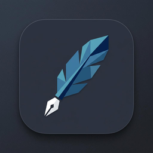
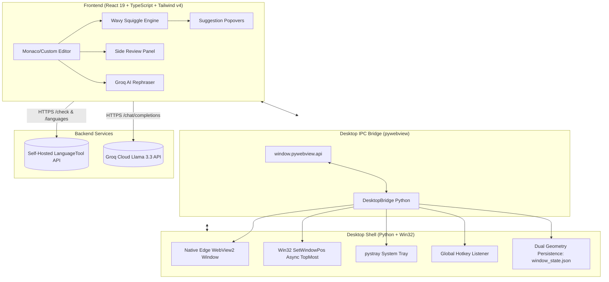

# langtool Windows Desktop Assistant

<p align="center">
  
</p>

<p align="center">
  <strong>A high-performance, ultra-lightweight Windows desktop companion for real-time grammar, spelling, and style correction with AI sentence rephrasing.</strong>
</p>

<p align="center">
  <a href="https://github.com/Ysn4Irix/langtool-win/releases"></a>
  
  
  
  <a href="https://github.com/Ysn4Irix/langtool-win/blob/master/LICENSE"></a>
</p>

---

## 🌟 Highlights

- 🪶 **Ultra-Lightweight & Instant:** Native Windows Edge WebView2 runtime (~25 MB RAM footprint, instantaneous startup, zero terminal console window in release).
- 📌 **Always-on-Top Mini Window Mode (`Ctrl+Shift+P`):** Transform the editor into a persistent floating sticky assistant widget that stays on top of code editors, browsers, Word, or PDFs.
- 📐 **Dual Independent Geometry Memory:** Remembers custom window dimensions, screen positions, and maximized states separately for both Studio Mode and Mini Mode.
- 〰️ **Native-Feel Wavy Squiggles:** Real-time color-coded diagnostics:
  - 🔴 **Red wavy squiggle:** Spelling errors and unknown words.
  - 🟠 **Amber wavy squiggle:** Grammar mistakes and punctuation anomalies.
  - 🔵 **Blue wavy squiggle:** Style, tone, and readability improvements.
- 💡 **Interactive Suggestion Popovers:** Instant replacement pills, clear grammar rules, and one-click ignore actions.
- 🪄 **Side Review Inspector & "Fix All":** Categorized issue breakdown with safe, conflict-free batch replacements.
- ✨ **AI Sentence Rephraser (Groq Llama 3.3):** Instant multi-tone sentence rewrites (Natural, Professional, Concise) in <250ms via Groq Cloud LPUs.
- 🌐 **60+ Languages & Auto-Detection:** Seamless switching across 60+ languages with automatic input language detection and auto-RTL script alignment (Arabic, Hebrew, Persian, Urdu).
- ☀️/🌙 **Dark & Light Mode:** Seamless three-way theme support (System OS Default, Pure Light, Midnight Dark).
- 📥 **System Tray & Global Hotkey (`Ctrl+Shift+L`):** Minimize to tray on close, summon from anywhere with a global keyboard shortcut.

---

## 📸 Overview

```
┌────────────────────────────────────────────────────────────────────────┐
│ [🪶 langtool]  [English (US) ▾]  [Auto-Detect]   [☀️] [📌] [🗕] [⚙️] [✕] │
├───────────────────────────────────────────────────────┬────────────────┤
│                                                       │ 🪄 Review (3)  │
│  The quick brown fox jumps over the lazzy dog.        ├────────────────┤
│                                     ~~~~~~            │ • Spelling (1) │
│                                                       │   "lazzy"      │
│                                                       │ • Grammar (1)  │
│                                                       │ • Style (1)    │
│                                                       │ [ Fix All (3) ]│
├───────────────────────────────────────────────────────┴────────────────┤
│ 🟢 API Connected (langtool.ysnirix.xyz)    9 words • 43 chars • 0.1 min │
└────────────────────────────────────────────────────────────────────────┘
```

---

## ⌨️ Keyboard Shortcuts

| Shortcut | Scope | Description |
| :--- | :--- | :--- |
| **`Ctrl + Shift + P`** | **Global / App** | **Toggle Mini Window Mode (Always-on-Top sticky assistant)** |
| **`Ctrl + Shift + L`** | **Global Windows** | **Summon / restore application from system tray to foreground** |
| **`Ctrl + Enter`** | In-App | Trigger immediate manual grammar and spelling check |
| **`Ctrl + Shift + R`** | In-App | Trigger Groq Cloud AI sentence rephraser for current text |
| **`Ctrl + Shift + C`** | In-App | Copy corrected text to system clipboard |
| **`Ctrl + ,`** | In-App | Open Settings modal (API URL, Theme, AI options) |
| **`Esc`** | In-App | Dismiss active suggestion popover or Settings modal |

---

## 🚀 Download & Installation

### Option 1: Standalone Portable Release (Recommended)
No installation, Python, or Node.js required.

1. Download the latest `langtool-v*-windows-x64-portable.zip` from [**Releases**](https://github.com/Ysn4Irix/langtool-win/releases).
2. Extract the ZIP archive anywhere on your machine.
3. Run **`langtool.exe`**.

### Option 2: Run from Source

#### Prerequisites
- Windows 10 or Windows 11 (64-bit)
- Python 3.10+
- Node.js 18+

#### Setup & Run
```powershell
# Clone the repository
git clone https://github.com/Ysn4Irix/langtool-win.git
cd langtool-win

# Install Node dependencies and Python packages
npm install
pip install -r requirements.txt

# Build the frontend and start the desktop app
npm run build
npm start
```

To run silently without any background command prompt console:
```powershell
npm run start:silent
```

---

## 🛠️ Building a Production Release

You can build the production-ready standalone distribution locally with a single command:

```powershell
npm run release
```

*This automated script ([`scripts/build_release.py`](scripts/build_release.py)):*
1. Builds and optimizes the frontend assets via Vite.
2. Compiles a windowed (`--noconsole`) executable using PyInstaller ([`langtool.spec`](langtool.spec)).
3. Bundles runtime DLLs and Edge WebView2 assets into `dist-app/langtool/`.
4. Creates a portable compressed archive: `dist-app/langtool-v0.1.0-windows-x64-portable.zip`.
5. Computes SHA256 checksums in `dist-app/checksums.txt`.

For detailed packaging instructions and GitHub Actions automation, see [**Packaging & Releases Guide**](docs/packaging-and-releases.md).

---

## 🏗️ Architecture



---

## ⚙️ Configuration & Custom Servers

langtool is pre-configured to use the hosted LanguageTool endpoint `https://langtool.ysnirix.xyz/v2/`.

You can also point it to any self-hosted or local instance (e.g. Docker):

1. Press `Ctrl + ,` or click the **Settings** gear icon in the top header.
2. Enter your custom API endpoint (e.g., `http://localhost:8010/v2`).
3. Click **Test Connection** to verify health and language support.
4. Click **Save Changes**.

---

## 📄 License

This project is licensed under the [MIT License](LICENSE).
