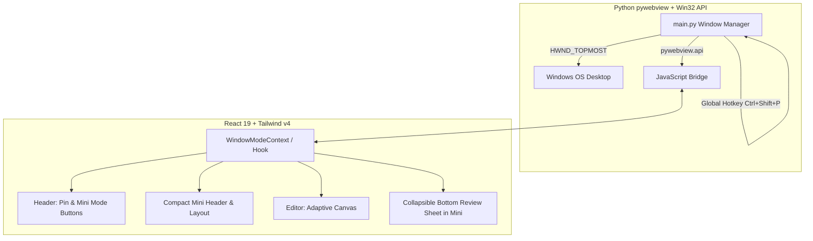

# Task Plan: Persistent Always-on-Top Mini-Window (Option A)

## 🎯 Goal
Enable `langtool` to seamlessly switch between full-sized **Studio Mode** (`~1020×720`) and an **Always-on-Top Mini Sticky Window** (`~360×460`), with dual window geometry memory, title bar pin controls, local/global keyboard shortcuts (`Ctrl+Shift+P`), and an adaptive compact UI.

---

## 🏗️ Architecture & Component Boundaries

---

## 📋 Task Breakdown

### Task 1: Python Bridge & Window Geometry Memory (`main.py`)
- Lower `min_size` in `pywebview` from `(760, 520)` to `(320, 240)` to allow compact mini sizes.
- Extend `window_state.json` to store separate `studio` geometry (`width`, `height`, `x`, `y`, `maximized`) and `mini` geometry (`width`, `height`, `x`, `y`).
- Expose a `DesktopBridge` class to JS via `js_api`:
  - `toggle_mini_mode()`
  - `set_mini_mode(enable: bool)`
  - `toggle_always_on_top()`
  - `set_always_on_top(enable: bool)`
  - `get_window_state()`
- Implement Win32 `HWND_TOPMOST` / `HWND_NOTOPMOST` toggle using `user32.SetWindowPos`.
- Register global hotkey `Ctrl+Shift+P` in Python to toggle mini mode / pin from anywhere.

### Task 2: React Window State & Bridge Service (`src/services/desktopBridge.ts`)
- Create TypeScript wrapper for `window.pywebview.api` with graceful web/dev fallback (so browser dev mode still runs).
- Expose typed methods: `toggleMiniMode()`, `togglePin()`, `getWindowState()`.
- Add local keyboard shortcut listener for `Ctrl+Shift+P` inside React.

### Task 3: Adaptive Header Controls (`src/components/Header.tsx`)
- Add interactive **Pin / Always-on-Top** toggle button with tooltip and visual active state.
- Add **Mini Mode / Studio Mode** toggle button (`Minimize2` / `Maximize2`).
- Provide condensed layout when `isMiniMode` is active:
  - Streamlined branding + language pill.
  - Compact issue counter pill.
  - Pin toggle + expand button.

### Task 4: Mini-Mode Responsive Layout & Bottom Sheet (`src/App.tsx`, `src/components/IssuesPanel.tsx`)
- In `App.tsx`, adapt layout when `isMiniMode`:
  - Hide full desktop right sidebar (`IssuesPanel` in side-by-side mode).
  - Render an expandable compact bottom drawer / review tray in Mini Mode with quick issue counts and Fix All.
  - Retain full squiggly underline highlights and floating `SuggestionPopover` directly in the editor.

### Task 5: Verification & Polish
- Verify build with `npm run build`.
- Test Python backend syntax and window bridge integration.
- Ensure state persistence cleanly maintains dual geometry across app restarts.
